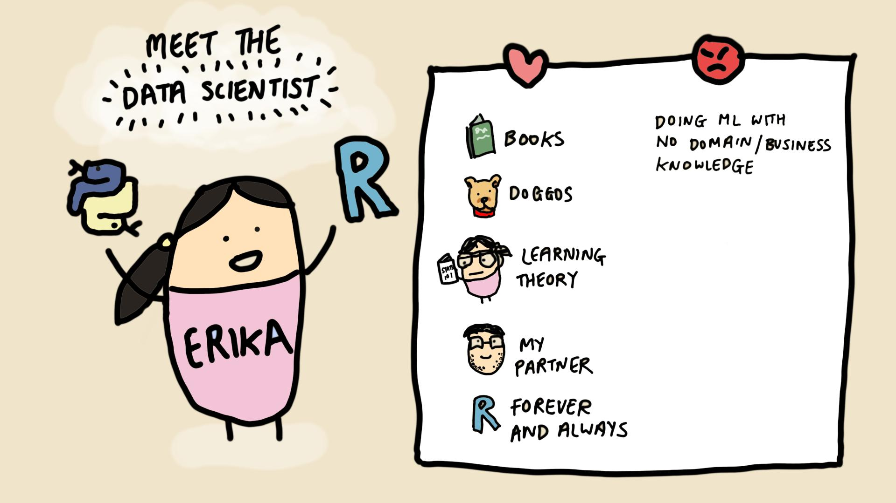

 

## :woman_technologist: Hi there!
I am a former biologist turned data scientist who is passionate about data science uplift in the public sector. My repositories contain R and Python programming tutorials, with a focus on data analysis, statistical modelling and machine learning.

## :woman_technologist: Stack
   
